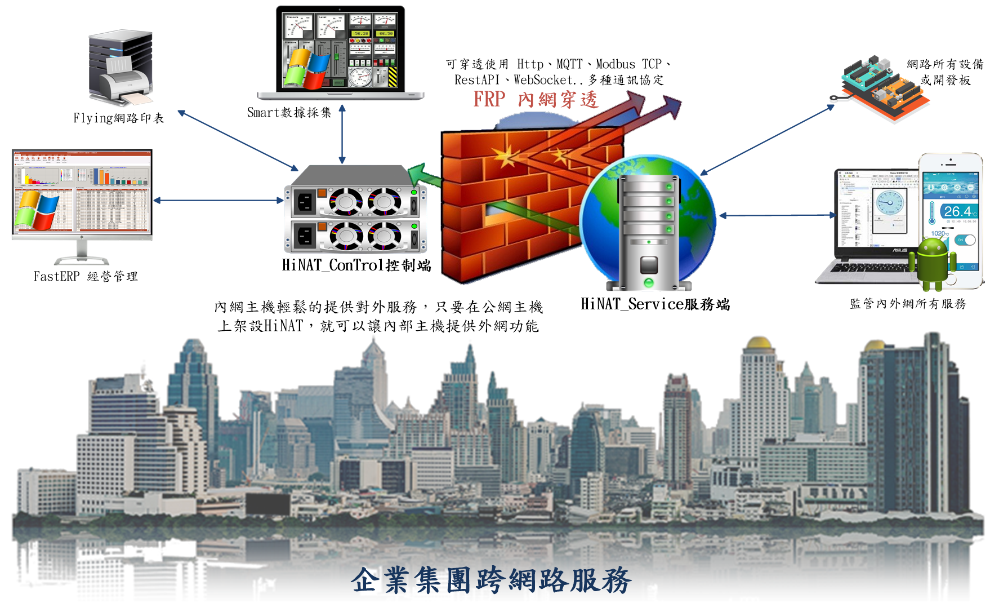

# HiNAT
HiNAT 內網穿透工具運用 FRP 功能，使用圖形化設置界面，通過通訊埠轉發技術，將本地埠轉發至服務端的目標埠，提供內網穿透服務，實現內網服務穿透至公網，支援的通訊類型包括 TCP、UDP 與 HTTP，並支援常見物聯網通訊協定的埠轉發，例如 WebSocket、MQTT、RestAPI、Modbus TCP ..等通訊協定。

> **加入 Facebook 社團**
>
> [https://www.facebook.com/groups/isoface/](https://www.facebook.com/groups/isoface/)
> 
> **點讚追蹤 Facebook 粉絲專頁**
> 
> [https://www.facebook.com/AIOT.ERP](https://www.facebook.com/AIOT.ERP)

HiNAT 包括服務端、控制端的內網穿透工具，提供遠端控制和內網穿透服務的解決方案。HiNAT 控制端基於 FRP 內網穿透，提供快速流暢的遠端控制服務。內網穿透工具為服務端，通過圖形化介面設置，可提供高性能、高效的反向代理服務。

特色： 
1. 運用 FRP 內網穿透技術，遠端控制頻寬消耗低，網路延遲低，具有更好的遠端控制效果。
2. 提供內網穿透服務程式，使用者可自行部署運行測試，不依賴於公有雲服務。
3. 提供圖形化介面的內網穿透配置方式，避免設定檔編寫導致的內網穿透服務運行錯誤，直觀簡單。
4. 提供網頁控制台，可對埠轉發、內網穿透、反向代理服務狀態進行監控與管理。
 
運用場景： 
1. 客戶即時遠端遙控，進行技術支援服務。
2. 內網部署服務提供公網訪問。
3. 部署通訊埠服務，實現埠轉發。
4. 支援反向代理服務，與 SSL 協定流量的轉發。
5. 物聯網設備的遠端存取服務。
例如：NodRed、MySQL、Web.....無需固定 IP 位址，都可在內網提供各種網路服務
